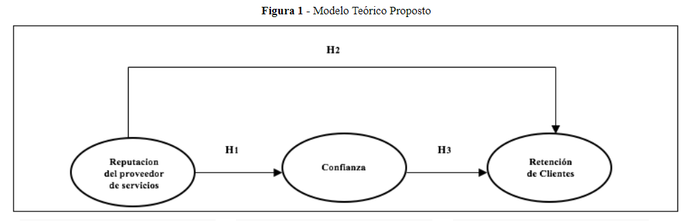
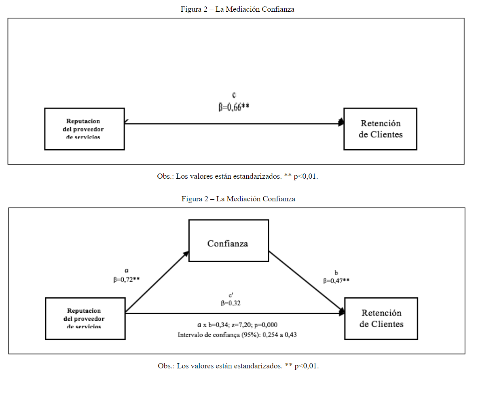
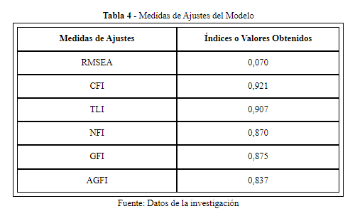
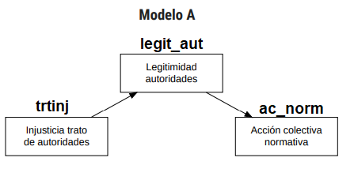

class: inverse, bottom, right

```{r, include=FALSE,echo=FALSE,results='hide'}
#install.packages("pagedown")
#pagedown::chrome_print("Presentacion.html",output="Presentacion.pdf")
```


```{r setup, include=FALSE, cache = FALSE}
require("knitr")
options(htmltools.dir.version = FALSE)
pacman::p_load(RefManageR)
```

```{r eval=FALSE, echo=FALSE}
# Correr esta linea para ejecutar
rmarkdown::render('xaringan::moon_reader')
```

```{r, echo=FALSE}

#install.packages("xaringan")
#install.packages("htmltools")
#install.packages("magrittr")
```


<!---
About macros.js: permite escalar las imágenes como [:scale 50%](path to image), hay si que grabar ese archivo js en el directorio.
.pull-left[<images/Conocimiento cívico.png>] 
.pull-right[<images/Conocimiento cívico_graf.png>]

--->

# __Analisis de senderos (PATH)__

### utilidad, teoría y aplicación con lavaan
<br>
<hr>


### _Grabriel Sotomayor_
### _Francisco Javier Meneses Rivas_


<br>

---

# Objetivo:
####  _Comprender la tecnica de path analisis, demostrando saber su utilidad y su aplicación con el paquete lavaan_

# Indice:

1. ¿Para qué sirve PATH? 
2. Modelamiento con PATH: __Diagramas, formulas y codigos__
3. Ejercicio practico: Aplicación de modelo PATH 

---

layout: true
class: animated, fadeIn

---
class: inverse, middle, center, slideInRight

#  Comprendiendo el uso de path
---
class: canvas

# "Los ingresos de los padres influyen en los resultados PSU" 

> ¿Qué opinamos sobre esto? 


???


Mediación 


---

# Resumen: Utilidad de path 


Path nos permite comprender __“cadenas causales”__, es decir, como variables se explican consecutivamente en el tiempo. Pasamos de hablar de “que explica algo” (regresión) al “como se explica algo” (modelo path), pues empezamos a hablar de __procesos de relaciones en el tiempo__. 

Permite evaluar mediaciones. Por ello, nos da luces para explicar "Como y porque x afecta a y". 

### Mediación

* Permite comprender cuanto del efecto de X sobre Y pasa a travez de una tercera variable M, y cuanto efecto es directo sin pasar por ella.

* Evaluación de efectos directos, indirectos y totales.


---
class: inverse, middle, center, slideInRight

# Modelamiento con PATH analisis 


---
# Ejmplo de modelamiento teorico con diagramas

Ejemplo: [_(EBERLE, MILAN,DE TONI & LAZZARI, 2016)_](https://www.revistaespacios.com/a16v37n25/16372525.html)

* H1: Una buena reputación de la empresa de servicios influye positivamente en la confianza del cliente en el proveedor de servicios.

* H2: La reputación positiva de la empresa proveedora de servicios influye positivamente en la retención de clientes.

* H3: La confianza depositada por el cliente en el proveedor de servicios influye positivamente en la retención de clientes.

* H4: La relación entre la reputación del proveedor de servicios y la retención de clientes es mediada por la confianza depositada por el cliente en el proveedor de servicios.

???

Actividad: hacer un diagrama de esto

---
# Ejmplo de modelamiento teorico con diagramas




???

identificar efecto directo e indirecto

---
class: inverse, middle, center, slideInRight
 
# Modelamiento en lavaan 
---

# ¿Como evaluamos este modelo con lavaan?

.center[

]

```{r, eval=FALSE}
# Cargar el paquete lavaan
library(lavaan)

# Definir el modelo, señalando las relaciones

model <- '
  confianza ~  reputacion
  retencion ~ confianza + reputacion'

#Evaluar modelo

fit <- lavaan::sem(model, data = tus_datos) #calcular 
summary(fit, standardized = TRUE, fit.measures = TRUE) #inspeccionar


```


---

class: inverse, middle, center, slideInRight
 
# Interpretación de resultados 


---


???

* __Efectos totales__: Efecto de X sobre Y, sin controlar por M (0,66**)

* __Efectos directos__: Efecto de X sobre Y, controlando por el efecto que pasa por M (0,32**)

* __Efectos indirectos__: Efecto de X sobre Y que pasa a traves de M (0,34**). Se calcula como el efecto X sobre M, multiplicado por el efecto de M sobre Y. 

> Leer resultados e interpretar

---
# Como leer el ajuste del modelo



* p de x2 < 0.05 

* X2/gl < 0.4

* RMSEA < 0.8, ideal < 0.5

* TLI/CFI > 0.9

---

# ¿Como se ve en r?

[Introduction to Path Analysis in R - Thomas Bihansky](https://rpubs.com/tbihansk/302732)

???

mpg: Millas por galón, es la eficiencia de combustible del automóvil, es decir, cuántas millas puede recorrer el automóvil por galón de combustible.
cyl: Número de cilindros del motor del automóvil.
disp: Desplazamiento (cilindrada) del motor en pulgadas cúbicas. Representa el volumen total de todos los cilindros del motor.
hp: Potencia neta del motor en caballos de fuerza (horsepower).
drat: Relación de engranajes traseros, es decir, la relación entre la velocidad del eje de transmisión y la velocidad del eje de transmisión trasero.
wt: Peso del automóvil en miles de libras.
qsec: Tiempo de cuarto de milla, es el tiempo que tarda el automóvil en recorrer un cuarto de milla desde un punto de partida en reposo.
vs: Tipo de motor (0 = motor en V, 1 = motor en línea).
am: Tipo de transmisión (0 = automática, 1 = manual).
gear: Número de marchas (engranajes) en la transmisión.
carb: Número de carburadores.

---

class: inverse, middle, center, slideInRight
 
# Practica en R 

---

# Para acceder a los datos:
.center[

]
---

# Actividad:

* Representen en lenguaje lavann el modelo

* Interpreten los resultados

* Evaluar parametros de ajuste

* Decidir el modelo




.small[ __reconocimiento__: Ejercicio propuesto por Cristobal Moya, Docente Magister y diplomado UDP]

